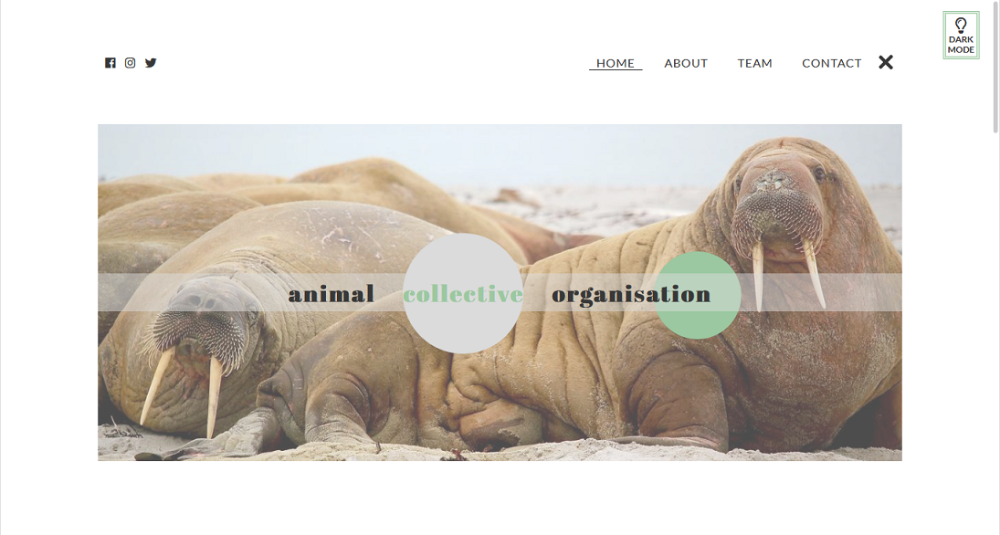
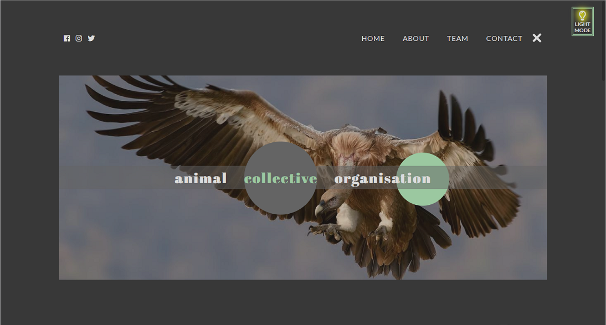
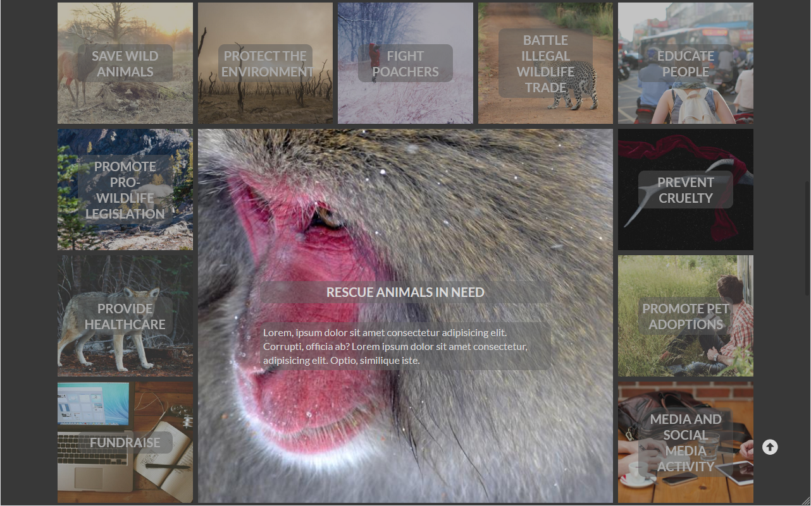

# Animal Collective - A Website

## General info
This project contains website of the nonexistent pro-animals organization made entirely with HTML, CSS and JS, without any extra tools. I wanted it to look both minimalistic and kind of cool, so I have decided to add some color to basic light/dark palette. 

### for general appearance of the site especially significant were: 
- CSS variables  
- CSS animations
- Pseudo elements 

## dark mode
Using only CSS variables and a simple JS function, I could fit this website with a dark mode. Below you can see how does it look when switched:

### wrapGrid
To animate grid section I did use the [wrapGrid](https://github.com/aholachek/animate-css-grid) by Alex Holachek. Thanks to the wrapGrid my website seems to be more perky.

In this project I used pictures from Lorem Picsum and Unsplash.  